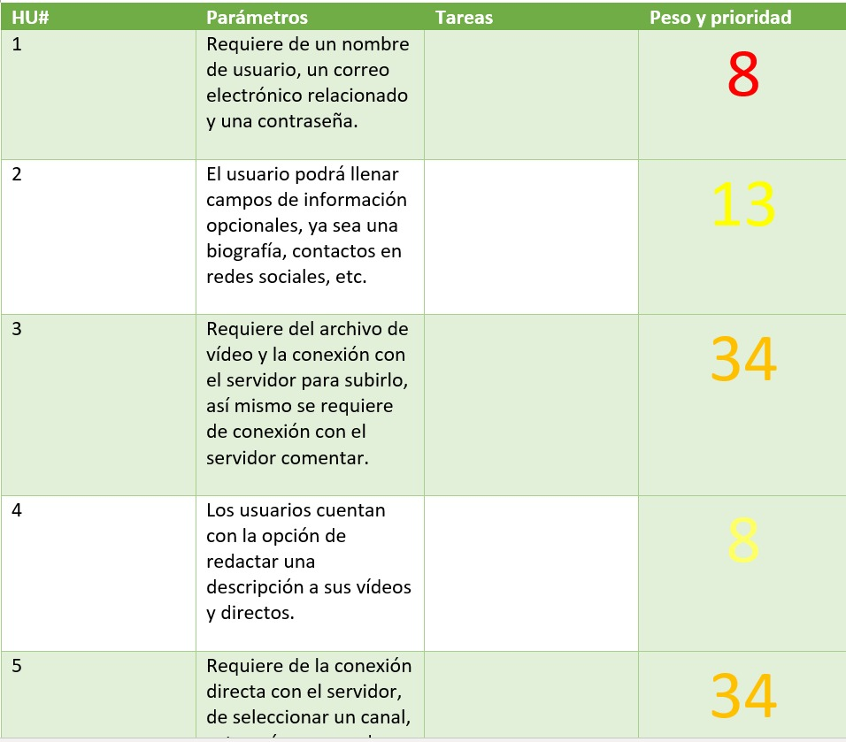
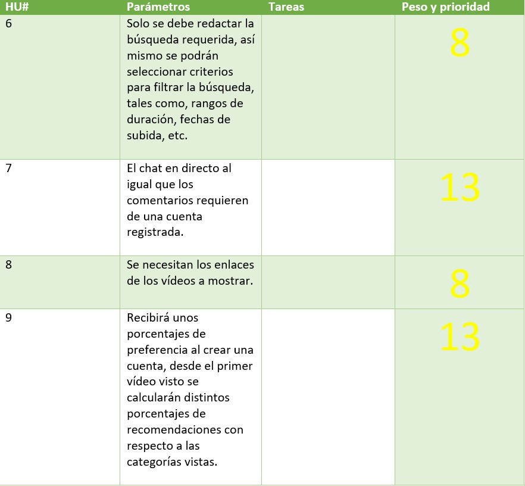

# Weetch
## Plataforma de videos

**Weetch** es una plataforma de video que consiste en dejar ver a sus usuarios videos en línea sobre algún tema en específico que ellos desean ver.

## Historias de usuario

Italicized text is the *cat's meow*.

This text is ***really important***.

> Dorothy followed her through many of the beautiful rooms in her castle.

> #### The quarterly results look great!
>
> - Revenue was off the chart.
> - Profits were higher than ever.
>
>  *Everything* is going according to **plan**.

## Tabla de prueba

| Tables        | Are           | Cool  |
| ------------- |:-------------:| -----:|
| col 3 is      | right-aligned | $1600 |
| col 2 is      | centered      |   $12 |
| zebra stripes | are neat      |    $1 |

## Lista
- uno
- dos
- tres
esto seria codigo
    <html>
      <head>
      </head>
    </html>
adasdasd

<https://www.markdownguide.org>

<fake@example.com>
    
    
