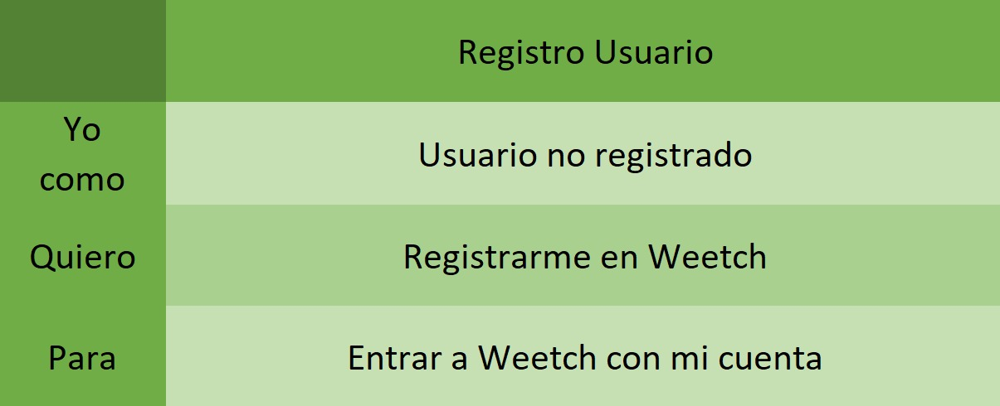
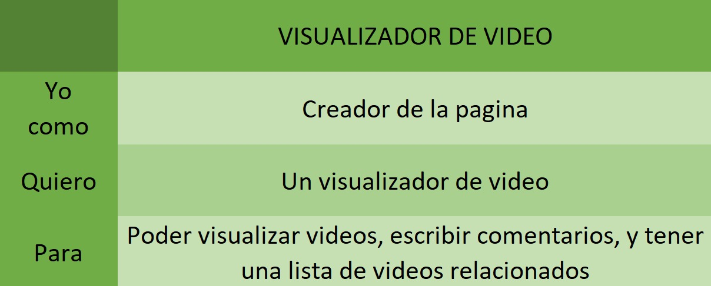
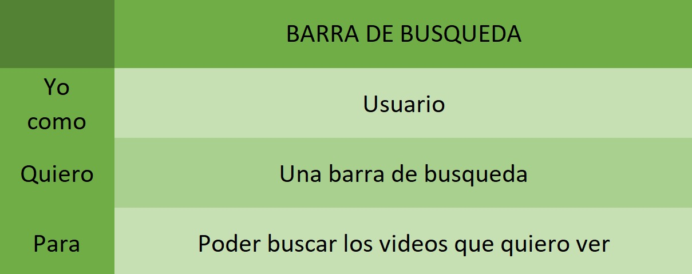
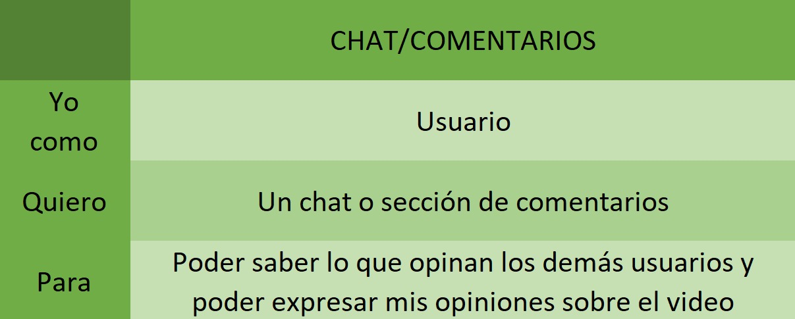
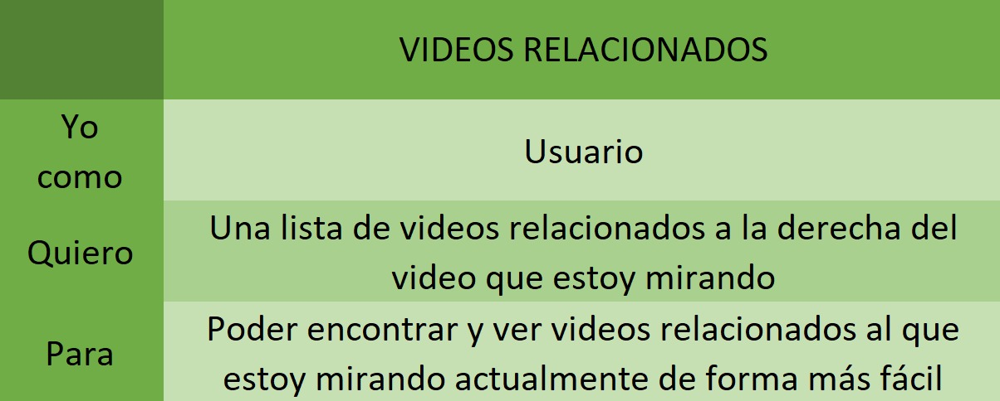
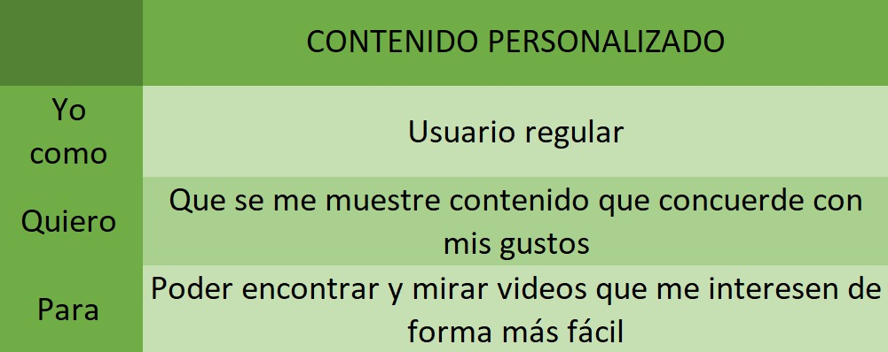
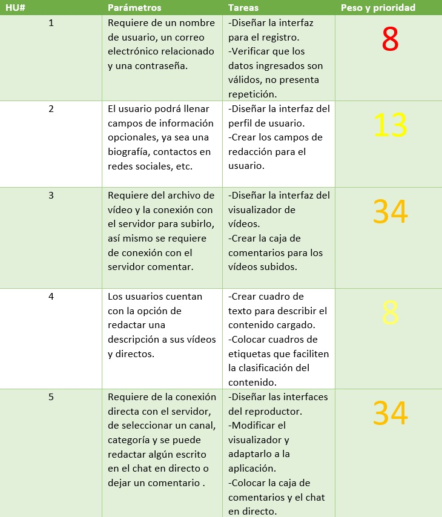
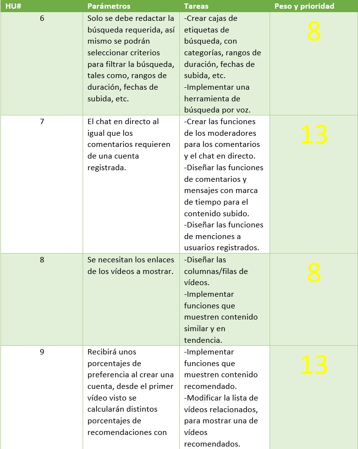

# Weetch
## Plataforma de videos

**Weetch** es una plataforma de video que consiste en dejar ver a sus usuarios videos en línea sobre algún tema en específico que ellos desean ver.

## Historias de usuario

## 1. Registro de usuario

## 3. Visualizador de video

## 4. Descripción de video

## 5. Reproductor

## 6. Barra de búsqueda

## 7. Chat de comentarios

## 8. Videos relacionados

## 9. Contenido personalizado

## Parametros, tareas, pesos y prioridades

